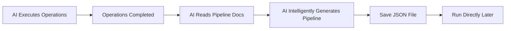

<!-- markdownlint-disable MD033 MD041 MD024 -->
<p align="center">
  
</p>

<div align="center">

# MaaMCP


  
[](https://github.com/MaaXYZ/MaaFramework)
[](https://pypi.org/project/maa-mcp/)

MCP Server based on [MaaFramework](https://github.com/MaaXYZ/MaaFramework)
Providing Android device and Windows desktop automation capabilities for AI assistants

English | [中文](README.md)

</div>

---

## Introduction

MaaMCP is a Model Context Protocol server that exposes MaaFramework's powerful automation capabilities through standardized MCP interfaces to AI assistants (like Claude). With this server, AI assistants can:

- 🤖 **Android Automation** - Connect and control Android devices/emulators via ADB
- 🖥️ **Windows Automation** - Control Windows desktop applications
  - 🎯 **Background Operation** - Screenshots and controls on Windows run in the background without occupying your mouse or keyboard, allowing you to continue using your computer for other tasks
- 🔗 **Multi-Device Coordination** - Control multiple devices/windows simultaneously for cross-device automation
- 👁️ **Smart Recognition** - Use OCR to recognize on-screen text
- 🎯 **Precise Operations** - Execute clicks, swipes, text input, key presses, and more
- 📸 **Screenshots** - Capture real-time screenshots for visual analysis

Talk is cheap, see: **[🎞️ Bilibili Video Demo](https://www.bilibili.com/video/BV1eGmhBaEZz/)**

## Features

### 🔍 Device Discovery & Connection

- `find_adb_device_list` - Scan available ADB devices
- `find_window_list` - Scan available Windows windows
- `connect_adb_device` - Connect to Android device
- `connect_window` - Connect to Windows window

### 👀 Screen Recognition

- `ocr` - Optical Character Recognition (efficient, recommended for priority use, OCR model auto-downloads on first use)
- `screencap` - Screenshot capture (use as needed, high token cost)

### 🎮 Device Control

- `click` - Click at coordinates (supports multi-touch/mouse button selection, long press)
  - On Windows, supports mouse button selection: left, right, middle
- `double_click` - Double click at coordinates
- `swipe` - Swipe gesture (preferred for scrolling/paging on Android)
- `input_text` - Input text
- `click_key` - Key press (supports long press)
  - On Android, simulates system keys: Back(4), Home(3), Menu(82), Volume keys, etc.
  - On Windows, supports virtual key codes: Enter(13), ESC(27), Arrow keys, etc.
- `keyboard_shortcut` - Keyboard shortcuts
  - Supports key combinations: Ctrl+C, Ctrl+V, Alt+Tab, etc.
- `scroll` - Mouse wheel (Windows only)

### 📝 Pipeline Generation

- `get_pipeline_protocol` - Get Pipeline protocol documentation
- `save_pipeline` - Save generated Pipeline JSON to file

## Quick Start

### Installation

#### Option 1: Install via pip (Recommended)

```bash
pip install maa-mcp
```

#### Option 2: Install from source

1. **Clone the repository**

    ```bash
    git clone https://github.com/MistEO/MaaMCP.git
    cd MaaMCP
    ```

2. **Install Python dependencies**

    ```bash
    pip install -e .
    ```

### Configure Clients

Add an MCP server to software such as Cursor:

```json
{
  "mcpServers": {
    "MaaMCP": {
      "command": "maa-mcp"
    }
  }
}
```

OR

Add an MCP command to software such as Cherry Studio:

```shell
maa-mcp
```

## Usage Examples

After configuration, you can use it:

**Android Automation Example:**

```text
Please use the MaaMCP tools to connect to my Android device, open Meituan, and help me order a Chinese meal (one portion) around 20 RMB.
```

**Windows Automation Example:**

```text
Please use the MaaMCP tools to show me how to add a rotation animation effect to the current PPT slide, and demonstrate the steps.
```

**Pipeline Generation Example:**

```text
Please use MaaMCP tools to connect to my device, help me open Settings, go to Display settings, and adjust brightness to 50%.
After completing the operations, generate a Pipeline JSON for this workflow so it can be run directly later.
```

MaaMCP will automatically:

1. Scan available devices/windows
2. Establish connection
3. Auto-download and load OCR resources (on first use)
4. Execute recognition and operation tasks

## Workflow

MaaMCP follows a streamlined operational workflow with multi-device/window coordination support:


1. **Scan** - Use `find_adb_device_list` or `find_window_list`
2. **Connect** - Use `connect_adb_device` or `connect_window` (can connect multiple devices/windows, each gets a unique controller ID)
3. **Operate** - Execute OCR, click, swipe, etc. on multiple devices/windows by specifying different controller IDs (OCR resources auto-download on first use)

## Pipeline Generation

MaaMCP supports AI converting executed operations into [MaaFramework Pipeline](https://github.com/MaaXYZ/MaaFramework) JSON format, enabling **operate once, reuse infinitely**.

### How It Works



1. **Execute Operations** - AI performs OCR, click, swipe, and other automation operations normally
2. **Get Documentation** - Call `get_pipeline_protocol` to get Pipeline protocol specification
3. **Intelligent Generation** - AI converts **valid operations** into Pipeline JSON based on the documentation
4. **Save File** - Call `save_pipeline` to save the generated Pipeline

### Advantages of Intelligent Generation

Unlike mechanical recording, AI intelligent generation offers these advantages:

- **Only Keeps Successful Paths**: If multiple paths were tried during operation (e.g., first entering Menu A without finding the target, then returning and entering Menu B to find it), AI will only keep the final successful path, removing failed attempts
- **Understands Operation Intent**: AI can understand the purpose of each operation and generate semantically clear node names
- **Optimizes Recognition Conditions**: Intelligently sets recognition regions and matching conditions based on OCR results

### Example Output

```json
{
  "StartTask": {
    "recognition": "DirectHit",
    "action": "DoNothing",
    "next": ["ClickSettings"]
  },
  "ClickSettings": {
    "recognition": "OCR",
    "expected": "Settings",
    "action": "Click",
    "next": ["EnterDisplay"]
  },
  "EnterDisplay": {
    "recognition": "OCR",
    "expected": "Display",
    "action": "Click",
    "next": ["AdjustBrightness"]
  },
  "AdjustBrightness": {
    "recognition": "OCR",
    "expected": "Brightness",
    "action": "Swipe",
    "begin": [200, 500],
    "end": [400, 500],
    "duration": 200
  }
}
```

### Running Generated Pipelines

Generated Pipeline JSON can be run via:

1. **Using MaaFramework Python Bindings**:

```python
from maa.resource import Resource
from maa.tasker import Tasker

resource = Resource()
resource.post_bundle("path/to/resource").wait()

tasker = Tasker()
tasker.bind(resource, controller)
tasker.post_task("StartTask").wait()
```

2. **Integrate into MaaFramework Project**: Place the JSON file in the project's `pipeline` directory

## Notes

📌 **Windows Automation Limitations**:

- Some games or applications with anti-cheat mechanisms may block background control operations
- If the target application runs with administrator privileges, MaaMCP must also be launched with administrator privileges
- Minimized windows are not supported; please keep the target window in a non-minimized state
- If the default background screenshot/input methods are unavailable (e.g., empty screenshots, unresponsive operations), the AI assistant may attempt to switch to foreground methods, which will occupy the mouse and keyboard

## FAQ

### OCR recognition fails with "Failed to load det or rec" or prompts that resources do not exist

On first use, OCR model files will be automatically downloaded. However, download failures may occur. Please check the data directory:

- Windows: `C:\Users\<username>\AppData\Local\MaaMCP\resource\model\ocr\`
- macOS: `~/Library/Application Support/MaaMCP/resource/model/ocr/`
- Linux: `~/.local/share/MaaMCP/resource/model/ocr/`

1. Check if model files exist in the above directory (`det.onnx`, `rec.onnx`, `keys.txt`)
2. Check for resource download errors in `model/download.log`
3. Manually run `python -c "from maa_mcp.download import download_and_extract_ocr; download_and_extract_ocr()"` to retry downloading

### About Issues

When filing an issue, please provide log files. The log file path is as follows:

- Windows: `C:\Users\<username>\AppData\Local\MaaMCP\debug\maa.log`
- macOS: `~/Library/Application Support/MaaMCP/debug/maa.log`
- Linux: `~/.local/share/MaaMCP/debug/maa.log`

## License

This project is licensed under [GNU AGPL v3](LICENSE).

## Acknowledgments

- **[MaaFramework](https://github.com/MaaXYZ/MaaFramework)** - Provides powerful automation framework
- **[FastMCP](https://github.com/jlowin/fastmcp)** - Simplifies MCP server development
- **[Model Context Protocol](https://modelcontextprotocol.io/)** - Defines AI tool integration standards
